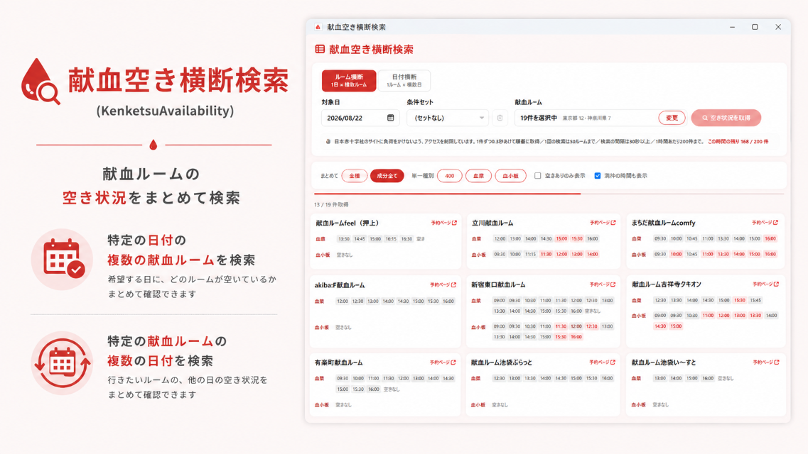

# ⚠️ 最初に必ずお読みください

> [!IMPORTANT]
> ### このアプリは、日本赤十字社の献血予約サイトを「想定されていない方法」で参照します
>
> **1. あえて手間のかかる配布形態にしています**
> 本アプリは kenketsu.jp の予約ページを読み取って、複数の献血ルームの空き状況を横断表示します。
> [ラブラッドの利用規約](https://www.kenketsu.jp/Terms)を確認したところ、**自動的なアクセスやデータの取得を
> 禁止する条項はありませんでした**（2026年8月12日時点。制定日 2022/9/1 の第1条〜第15条に禁止事項の条項自体がなく、
> `robots.txt` も予約ページを含めて `Allow: /` です）。
> ただし、**禁止されていないことと、想定された使い方であることは別です。**
> そのため、ブラウザから誰でも気軽に叩けるWebサービスとしては公開せず、
> **exeをダウンロードして自分のPCで実行する**という、ひと手間かかる形にしています。
> 不特定多数のアクセスが1か所に集中しないようにするためです。
>
> **2. だからレートリミットを入れています**
> 先方サイトへ過度な負荷をかけないよう、アプリ側で取得を制限しています。
> 詳細は[レートリミット](#レートリミット)を参照してください。
> **この制限を外して利用しないでください。**
>
> **3. 日本赤十字社から要請があれば公開を停止します**
> 日本赤十字社から中止・削除のご要請をいただいた場合、本リポジトリおよび配布物の公開を速やかに停止します。
> あわせて、配布済みのアプリについても、**アプリ自身が起動時に読みにいく設定ファイルで
> 停止を伝えられる**ようにしています（[利用停止の仕組み](#利用停止の仕組み)）。
> 利用者のPCを遠隔操作するものではありません。
>
> **4. 利用者のみなさんへ／日本赤十字社の関係者の方へ**
> - **利用者の方へ**：上記のとおり、先方の善意のサービスに乗らせてもらっている立場です。
>   必要以上に連打しない、常時起動して回し続けないなど、**節度をもってご利用ください。**
>   空き状況の確認はこのアプリで行い、**予約は必ず公式サイトから**行ってください。
> - **日本赤十字社の関係者の方へ**：本アプリの挙動が不適切、あるいは公開自体が望ましくないとお考えの場合は、
>   遠慮なくご連絡ください。速やかに対応します。
>   - GitHub Issues: このリポジトリの [Issues](../../issues)
>   - 連絡先ページ: https://noobow-bot-contact.pages.dev/
>   - 本アプリのアクセスは User-Agent に `Noobow Bot (contact: https://noobow-bot-contact.pages.dev/)` を付けて識別できるようにしています。

---

# 献血空き横断検索（KenketsuAvailability）

複数の献血ルームの予約空き状況を、日付を指定して横断的に一覧できる Windows デスクトップアプリです。

- **ルーム横断**（1日 × 複数ルーム）と**日付横断**（1ルーム × 複数日）の2方向で検索できる
- 全血400・血漿・血小板の空き時間を並べて表示
- 都道府県・地方でまとめて選択でき、よく使う組み合わせは「条件セット」として保存できる
- 空きのあるルームだけに絞り込み、満枠の時間の表示/非表示も切り替え可能
- 予約ページへのリンクから、そのまま公式サイトで予約できる

## ダウンロード

### ⬇ [最新版をダウンロード（v1.1.0）](https://github.com/noobow34/KenketsuAvailability/releases/download/v1.1.0/KenketsuAvailability-v1.1.0-win-x64.exe)

ダウンロードした exe をそのまま実行するだけです。
インストール作業や .NET ランタイムの導入は不要です（自己完結・単一ファイル）。
過去のバージョンや変更履歴は [Releases](../../releases) と [CHANGELOG.md](CHANGELOG.md) を参照してください。

| 項目 | 内容 |
|------|------|
| 対応OS | Windows 10 1809 以降 / Windows 11（x64） |
| 必要なもの | WebView2 ランタイム（Windows 11 には標準で入っています）、インターネット接続 |
| 設定の保存先 | `%APPDATA%\KenketsuAvailability\` |
| アンインストール | exe と上記フォルダを削除するだけ |

## 使い方

1. アプリを起動すると、作者の設定（献血ルーム一覧・お知らせ）を読み込みます
2. 検索方向を選びます
   - **ルーム横断**：1つの日について、複数の献血ルームを横断して探す
   - **日付横断**：1つの献血ルームについて、複数の日を横断して探す
3. 条件（対象日・献血ルーム）を選びます
4. 「空き状況を取得」を押すと、1件ずつ順番に確認して結果を表示します
5. 気になる枠の「予約ページ」リンクから、公式サイトで予約してください

よく使うルームの組み合わせは「条件セット」に名前を付けて保存できます。
前回の対象日と選択内容は自動で復元されます。

## レートリミット

日本赤十字社のサイトへ負荷をかけないよう、アプリ側でアクセスを制限しています。
制限の内容と現在の残り枠は、アプリの画面上にも常時表示されます。

| 項目 | 既定値 |
|------|--------|
| 同時リクエスト | 1（1件ずつ順番に取得） |
| ルーム間のウェイト | 0.3秒 |
| 1回の検索の上限 | 50ルーム（ルーム横断）／ 7日（日付横断） |
| 検索と検索の間隔 | 30秒以上 |
| 1時間あたりのリクエスト数 | 200件 |

- 上限に達している間は「空き状況を取得」ボタンが押せません。
- 1時間あたりのカウンタは設定ファイルに保存されるため、**アプリを再起動しても回復しません**。
- 制限値は作者側から変更できます。状況に応じて、より厳しい値に変更する場合があります。

## 利用停止の仕組み

日本赤十字社からご要請をいただいた場合などに、配布済みのアプリについても取得を止められるようにしています。
仕組みは単純で、**アプリが起動するたびに、作者が公開している設定ファイルを読みにいくだけ**です。

1. アプリを起動すると、作者が公開している設定ファイル（Googleスプレッドシートを
   CSVとして公開したもの）を読み込みます
2. その中に「使用可能フラグ」と、献血ルームの一覧・アクセス制限値が入っています
3. フラグが「無効」になっていると、アプリは検索画面を出さず、停止中である旨を表示します

### これは遠隔操作ではありません

「遠隔で止める」と書くと、作者が利用者のPCを操作できるように聞こえるかもしれませんが、違います。
アプリが自分から設定ファイルを**読みにいっているだけ**で、外から入ってくる経路はありません。

- **通信はアプリからの読み取り（GET）だけ**です。作者側のサーバーへ利用者の情報を送る処理はありません
  （ソースコードを検索すれば、送信にあたる処理が1つも無いことを確認できます）
- **PCを操作する機能はありません。** 止められるのはこのアプリの検索機能だけで、
  ファイルを消す、他のソフトを操作するといったことは一切しません
- **常駐しません。** アプリを終了すれば通信も停止も起こりません。設定を読むのは起動時の1回だけです
- 書き込むのは `%APPDATA%\KenketsuAvailability\` にある自分の設定ファイルとログだけです

### 設定を読めなかったときは動きません

ネットワークが切れている、設定ファイルが消えている、といった場合も検索できません。
手元にキャッシュを持って動いてしまうと、停止フラグを立てても止まらなくなるためです。
アプリ自体がインターネット接続を前提にしているので、この割り切りにしています。

停止した理由や連絡事項は、アプリ内の「作者からのお知らせ」に表示されます。

## 免責

- 本アプリは日本赤十字社とは一切関係のない、個人が作成した非公式のツールです。
- 表示される空き状況は取得時点のもので、正確性・最新性を保証しません。実際の空き状況は必ず公式サイトでご確認ください。
- 本アプリの利用によって生じたいかなる損害についても、作者は責任を負いません。

## ライセンス

[MIT License](LICENSE)

## 開発者向け

ビルド方法、設定スプレッドシートの構成、リリース手順などは
[docs/DEVELOPMENT.md](docs/DEVELOPMENT.md) を参照してください。
